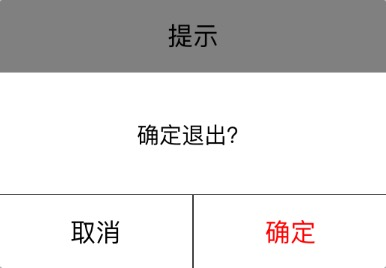

# XFDialogBuilder

[](http://cocoadocs.org/docsets/XFSettings)


可配置型IOS对话框，使用者定制蒙版层背景、窗口大小、UI主题、文本内容、字体大小、布局内容、弹出消失动画引擎。


##开源经验谈
当初项目中要使用对话框处理各种信息，在github和code4app中找了几个中意的，但都不能完全和项目进行融合，这些开源项目动画效果炫、UI很精致，但定制性不强，它们封的太死板了，所谓的一行代码显示效果，在对话框视图根本就是胡扯。本想自己随便布个局，就能显示一个对话框，但项目很多地方都要显示这样的对话框，复用性太差，基于此，决定自己搭一个对话框框架模板，然后根据基本模板向下扩展，在项目不停变化，这个框架也经历了多次迭代，做了对正确、错误信息、输入验证的处理，动画引擎的加入，向外提供不同样式的配置字段，这才开源出来。

##XFDialogBuilder框架特点
1.快速开发，使用json搭建界面。

2.相比其它高度封装+酷炫框架([SIAlertView](https://github.com/Sumi-Interactive/SIAlertView)、[SCLAlertView](https://github.com/dogo/SCLAlertView)、[AMSmoothAlertView](https://github.com/mtonio91/AMSmoothAlert)等)，本框架UI定制性更强,，需求更符合国情，是真正能拿到自己项目用的。

3.使用者能分别自定义弹入、弹出动画引擎，可使用IOS自带动画方式，也可用其它第三方引擎，如[pop](https://github.com/facebook/pop)、[MMTweenAnimation](https://github.com/adad184/MMTweenAnimation)、[JHChainableAnimations](https://github.com/jhurray/JHChainableAnimations)等（兼容所有UIView动画引擎的嵌入)。

4.扩展性强，提供多种对话框类型，开发者可自己基于模板进行扩展。

5.内置强大输入框验证系统，开发者可自定义配置验证规则。

6.最低支持到IOS6。

##安装
1、通过cocoapods
> pod 'XFDialogBuilder','1.0.2'

2、手动加入

把XFDialogBuilder整个目录拖入到工程，添加依赖库`pop`、`UITextView+Placeholder`。

##Demo运行注意
需要用命令行:

1.`cd ...XFDialogBuilderExample`("..."要根据自己的路径来)

2.`pod install`

##开发文档
###一、快速开始
1.导入主头文件`#import "XFDialogBuilder.h"`

2.在控制器引用`@property (nonatomic, weak) XFDialogFrame *dialogView;`

3.显示对话框


```objc
    __weak ViewController *weakSelf = self;
    self.dialogView =
    [[XFDialogNotice dialogWithTitle:@"提示"
                               attrs:@{
                                          XFDialogTitleViewBackgroundColor : [UIColor grayColor],
                                          XFDialogNoticeText: @"确定退出？",
                                          XFDialogLineColor : [UIColor darkGrayColor],
                                          }
                         commitCallBack:^(NSString *inputText) {
                             [weakSelf.dialogView hideWithAnimationBlock:nil];
                         }] showWithAnimationBlock:nil];
```

###二、框架文档
####1.顶级显示容器`XFDialogFrame`
这是布局的核心类，也作为与`XFMaskView`沟通的桥梁，后者是用来显示和动画执行关键类，所以基于`XFDialogFrame`的子控件具有显示和动画执行的能力，所以开发者不用关心`XFMaskView`。

下图是框架整体结构：


#####1.1.扩展子控件
子控件必须实现以下方法：
```objc
/**
 *  添加子视图
 */
- (void)addContentView;
/**
 *  对话框大小
 *
 *  @return Size
 */
- (CGSize)dialogSize;
```

#####1.2.容器配置属性
子控件类都会继承自`XFDialogFrame`这些配置：
```objc
// 注意：以下属性都有默认设置
/** 遮罩层背景色 UIColor类型*/
extern const NSString *XFDialogMaskViewBackgroundColor;
/** 遮罩层透明度 float类型*/
extern const NSString *XFDialogMaskViewAlpha;
/** 对话框大小 CGSize类型*/
extern const NSString *XFDialogSize; // 如果不设置，会根所当前对话框类型自己计算
/** 对话框圆角 float类型*/
extern const NSString *XFDialogCornerRadius;
/** 对话框背景色 UIColor类型*/
extern const NSString *XFDialogBackground;
/** 对话框线条颜色 UIColor类型*/
extern const NSString *XFDialogLineColor;
/** 对话框线条宽度 float类型*/
extern const NSString *XFDialogLineWidth;
/** 对话框子内容的间隔 float类型*/
extern const NSString *XFDialogItemSpacing;
/** 对话框标题背景色 UIColor类型*/
extern const NSString *XFDialogTitleViewBackgroundColor;
/** 对话框标题颜色 UIColor类型*/
extern const NSString *XFDialogTitleColor;
/** 对话框标题font float类型*/
extern const NSString *XFDialogTitleFontSize;
/** 对话框标题高度 float类型*/
extern const NSString *XFDialogTitleViewHeight;
/** 对话框标题对齐方式 float类型*/
extern const NSString *XFDialogTitleAlignment;
/** 对话框标题是否为多行 Bool类型*/
extern const NSString *XFDialogTitleIsMultiLine;
```
#####1.3.构建对话框
所有子控件都通过下面方法显示对话框，子控件添加自己的视图则通过`- (void)addContentView;`勾子方法。
```objc
/**
 *  构建对话框
 *
 *  @param title          标题
 *  @param attrs          对话框属性
 *  @param commitCallBack 确定输入内容的回调
 *
 */
+ (instancetype)dialogWithTitle:(NSString *)title attrs:(NSDictionary *)attrs commitCallBack:(commitClickBlock)commitCallBack;
```


